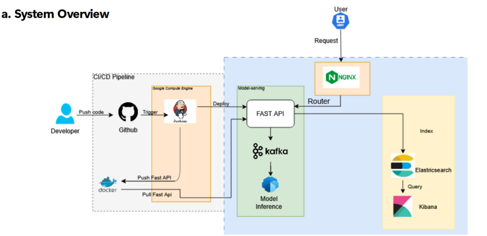

# VeronChatBot

<b>System Desgin:</b>



<b>Run Repo:</b>

Tải Ollama 

https://ollama.com/download/windows

Mở terminal: ollama pull llama3.2:1b

```
cd webapp
docker compose up --build
cd frontend
npm run dev
cd ../backend
pip install -r requirements.txt
python main.py 
```

Chạy các Service đặc biệt:

<b>a. Nginx:</b>

<b>b. Elasticsearch:</b>

<b>c. Kafka:</b>

<b>d. Agents:</b>
